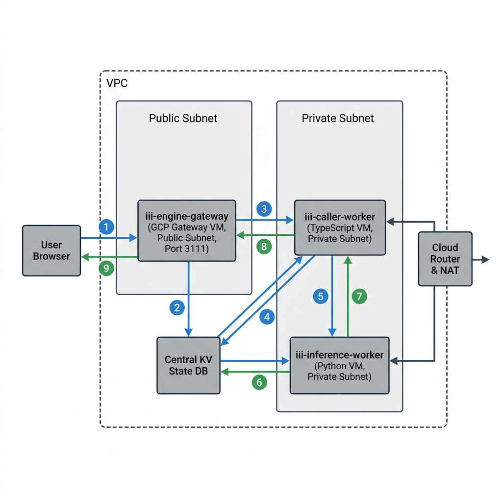

# Distributed Satirical VC Valuation Platform

A multi-language distributed microservice platform deployed on Google Cloud Platform (GCP) with strict Virtual Private Cloud (VPC) subnet isolation, coordinated via WebSocket-based RPC handlers and automated systemd deployment pipelines.

The platform simulates a satirical venture capital valuation engine where startup pitches are processed dynamically, valuations are calculated based on buzzword density, and global VC capital burn metrics are tracked in centralized persistent state.

---

## System Architecture

The infrastructure separates public entrypoints from backend workers. Private workers communicate inside an isolated subnet with egress limited via Cloud NAT, and receive tasks from the gateway VM via WebSocket-RPC.



### Network Topology & VM Node Specifications

#### 1. Engine Gateway (`iii-engine-gateway`)
* **Network Segment**: Public Subnet (`10.0.1.0/24`)
* **Public Ports**: 
  * `3111` (Public HTTP API Gateway)
  * `49134` (Internal WebSocket-RPC Engine Hub)
* **Role**: Public load-balancer ingress, WebSocket-RPC message broker, and SSH Bastion/ProxyJump gatekeeper.

#### 2. TypeScript Caller Worker (`iii-caller-worker`)
* **Network Segment**: Private Subnet (`10.0.2.0/24` — No public IP)
* **Egress**: Cloud NAT (for package updates and npm installations)
* **Registered RPC Functions**:
  * `http::serve_playground` (Triggered on `GET /` to render the minimal dashboard)
  * `http::add_two_numbers` (Triggered on `POST /startup/pitch`)
  * `math::add_two_numbers` (Orchestrates target payloads to the Python VM)

#### 3. Python Inference Worker (`iii-inference-worker`)
* **Network Segment**: Private Subnet (`10.0.2.0/24` — No public IP)
* **Egress**: Cloud NAT (for pip environment initialization)
* **Registered RPC Functions**:
  * `math::add` (Calculates base + buzzword valuations, queries/updates centralized state, and compiles satirical pitches)

---

## Detailed Data Flow & Request Lifecycle

```text
User Browser              Engine Gateway VM (Public)           TS Caller Worker VM (Private)        Python Inference VM (Private)
     │                                │                                     │                                    │
     │─── HTTP GET / or POST ────────▶│                                     │                                    │
     │                                │─── Forward RPC via WebSocket ──────▶│                                    │
     │                                │                                     │─── VM-to-VM RPC (math::add) ──────▶│
     │                                │                                     │                                    │─── Get VC Burn State ──┐
     │                                │                                     │                                    │◀── Return State ───────┘
     │                                │                                     │                                    │─── Set VC Burn State ──┐
     │                                │                                     │                                    │◀── Return State ───────┘
     │                                │                                     │◀── Return Valuation & Pitch ───────│
     │                                │◀── Return HTTP payload envelope ────│                                    │
     │◀── Render Dashboard / JSON ────│                                     │                                    │
```

1. **HTTP Ingress**: The user issues a `GET /` request or submits a startup pitch via `POST /startup/pitch` to the `iii-engine-gateway` VM on port `3111`.
2. **Gateway Forwarding**: The Gateway VM matches the route configuration and dispatches the payload internally across port `49134` using WebSocket-RPC.
3. **Orchestration**: The TS Worker (`iii-caller-worker`) accepts the connection, parses inputs, and fires an internal VM-to-VM RPC request targeting `math::add`.
4. **Calculations**: The Python Worker (`iii-inference-worker`) detects the registered `math::add` task, computes a base valuation of $10M, increments $5M per buzzword, and applies a `1.5x` multiplier for every match.
5. **State Query & Update**:
   * Python sends a `state::get` request to the central state service to retrieve the `"total_capital_burned"` variable under the `"vc_tracker"` scope.
   * Calculates the new total by appending the current startup's valuation.
   * Calls `state::set` to save the persistent state to the centralized DB file (`./data/state_store.db`).
6. **Payload Construction**: Python returns the generated satirical VC pitch, dynamic valuation, and updated total burn numbers to the TS worker.
7. **Response Decoration**: The TS worker appends interoperability metadata and returns a fully formatted response payload to the Engine Gateway, which responds back to the client browser.

---

## Interactive Web Playground

The TypeScript worker serves a responsive financial-terminal-inspired dashboard directly from the public Gateway VM.

### Public URL
```text
http://35.239.123.59:3111/
```

### Playground UI


---

## Live API Verification

You can test the backend pipeline directly via standard curl requests.

### Example Request
```bash
curl -X POST http://35.239.123.59:3111/startup/pitch \
  -H "Content-Type: application/json" \
  -d '{
    "idea": "A simple list app",
    "buzzwords": ["AI", "blockchain", "agentic"]
  }'
```

### Expected Output
```json
{
  "idea": "A simple list app",
  "buzzwords_detected": [
    "AI",
    "blockchain",
    "agentic"
  ],
  "satirical_pitch": "We are leveraging an autonomous multi-agent synergy framework and decentralized ledger security layer to systematically disrupt the traditional A simple list app landscape at infinite scale.",
  "estimated_valuation_usd": 84375000,
  "global_vc_capital_burned_usd": 84375000,
  "success": "VC funding round successfully closed! The board approves of your paradigm shift.",
  "interoperability_note": "Success! This payload was processed by a TypeScript worker, routed over the private VPC subnet via RPC, analyzed by a Python worker, saved to a central state DB, and returned back seamlessly."
}
```

---

## Project Repository Structure

```text
.
├── detailed_architecture_flow.png       # Highly-detailed vector system topology
├── architecture_diagram.png             # Visual high-level networking flow diagram
├── snapshot.png                         # High-fidelity dashboard terminal mockup
├── scripts/
│   └── deploy.sh                        # Bastion SSH automated VM installer script
├── infrastructure/
│   ├── modules/
│   │   ├── gcp-network/                 # VPC, public/private subnets, Cloud NAT configuration
│   │   └── gcp-vm/                      # Compute Engines, metadata startups, and disk profiles
│   └── environments/
│       └── dev/
│           ├── main.tf                  # Infrastructure composition entrypoint
│           ├── variables.tf             # Project inputs
│           ├── terraform.tfvars         # SSH keys and Project configurations
│           └── outputs.tf               # Public and private IP mappings
└── quickstart/
    ├── config.yaml                      # Central iii Gateway router configuration
    └── workers/
        ├── caller-worker/
        │   ├── src/
        │   │   ├── worker.ts            # TS RPC endpoint mapping & orchestration
        │   │   └── playground.ts        # Flat dark terminal HTML mockup
        │   └── package.json             # NPM dependencies
        └── math-worker/
            ├── math_worker.py           # Satirical engine calculations & state persistence
            └── requirements.txt         # Pip dependencies
```

---

## Deployment Pipeline & Script Optimizations

The deployment process uses standard SSH ProxyJumping to provision and deploy codebases to internal VM networks safely.

The orchestration runner at `scripts/deploy.sh` executes the following sequence:
1. **IP Retrieval**: Automatically queries terraform outputs for `engine_public_ip`, `engine_private_ip`, `caller_private_ip`, and `inference_private_ip`.
2. **Archival Compression**: Packages the code into `/tmp/quickstart.tar.gz` and strictly excludes local node packages, virtual environments, local database states, lock files, and caches to maintain rapid transmission:
   * `node_modules` / `.venv`
   * `.next` / `__pycache__` / `.pytest_cache`
   * `.git`
   * `*.db` / `*.lock`
3. **VM Configuration**: Interpolates the dynamic `ENGINE_PRIVATE_IP` into the systemd service template descriptors.
4. **Gateway Service Deployment**: Transfers code via `scp`, unpacks files on the Engine Gateway, moves `engine.service` into systemd directories, reloads the daemon, and starts/restarts the engine process.
5. **Private VM Deployments**: Securely pipes packages through the Gateway Bastion VM (`ProxyJump`) to `iii-caller-worker` and `iii-inference-worker`.
6. **Remote Execution**:
   * Installs Node packages locally on the Caller worker.
   * Triggers a Python virtual environment setup (`venv`) on the Inference worker, upgrades `pip`, and installs specified modules via `requirements.txt`.
   * Provisions and initializes systemd `caller` and `inference` services.

---

## Step-by-Step Deployment Guide

### 1. Authenticate with Google Cloud
Verify local installations of `gcloud` and `terraform`, then configure access tokens:
```bash
gcloud auth login
gcloud auth application-default login
gcloud services enable compute.googleapis.com
```

### 2. Generate SSH Authentication Keys
Create dedicated SSH deployment keys:
```bash
ssh-keygen -t ed25519 -f ~/.ssh/id_gcp -N ""
```

### 3. Setup Terraform Variables
Navigate to the terraform configuration file at `infrastructure/environments/dev/terraform.tfvars` and update with active project specifics:
```hcl
project_id     = "YOUR_GCP_PROJECT_ID"
ssh_user       = "vishal"
ssh_public_key = "ssh-ed25519 AAAAC3... [Paste matching id_gcp.pub contents]"
```

### 4. Provision Network Nodes
Apply Terraform recipes to create the VPC networks, Firewalls, Cloud NAT gateways, and VMs:
```bash
cd infrastructure/environments/dev
terraform init
terraform apply -auto-approve
```

### 5. Execute Codebase Orchestration
Run the automated deployment script from the repository root:
```bash
chmod +x scripts/deploy.sh
./scripts/deploy.sh
```

---

## Production Security & Hardening Recommendations

1. **Scoped Service Accounts**: Replace default Compute Engine service accounts on the VMs with dedicated IAM identities matching only necessary permissions (e.g., read-only access to specific GCS paths).
2. **Remote Backend State**: Store Terraform states in a locked, version-controlled Google Cloud Storage (GCS) bucket rather than locally to prevent state corruption.
3. **Ingress Restrictions**: Tighten SSH firewall exposure to authorized IP address subnets (such as VPN gateways or static office IPs) instead of public `0.0.0.0/0` endpoints.
4. **Cloud Load Balancing & SSL**: Place a Global External Application Load Balancer in front of the Engine Gateway to handle SSL termination, Web Application Firewalls (WAF), and DDoS mitigation.
5. **Observability Logging**: Configure Google Cloud Logging agents on VM nodes to export structured logs (`jsonPayload`) for centralized debugging, trace metrics, and anomaly detection.

---

## Infrastructure Scaling Strategy for Massive Inference Models

If inference workloads scale to production volumes (e.g., migration from rule-based calculations to high-concurrency LLMs):

1. **Kubernetes Migration**: Port worker scripts into container images and run on Google Kubernetes Engine (GKE) node pools backed by target accelerators (NVIDIA L4 or A100 GPUs) for optimized serving.
2. **Dedicated Serving Frameworks**: Deploy serving frameworks like Triton Inference Server or vLLM to utilize dynamic request batching, KV caching, and model quantization.
3. **Queue Decoupling**: Introduce RabbitMQ or Apache Kafka message brokers to buffer massive HTTP request surges, keeping VM workers free of sync bottleneck pressure.
4. **Horizontal Scaling**: Bind autoscaling thresholds to Queue Depth metrics via KEDA (Kubernetes Event-driven Autoscaling) to scale GPU worker replicas to zero when idle and rapidly scale up when task counts rise.

---

### Author
**Vishal Patil**